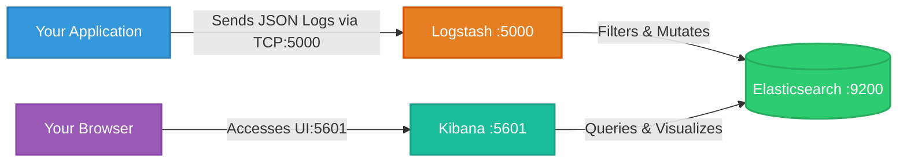

# Docker ELK Stack — Production-Oriented Deployment

Developed and maintained by **Mahdi Abbaszadeh**

A production-oriented deployment of the ELK stack (Elasticsearch, Logstash, Kibana) using Docker Compose — with persistent volumes, a dedicated private network, healthchecks, environment-based configuration, and dependency management between services.

---

## What Is ELK?

ELK is the most widely used log aggregation and observability stack in the industry:

| | Tool | Role |
|---|---|---|
| **E** | **Elasticsearch** | Stores, indexes, and makes logs searchable. A distributed database optimized for full-text search. |
| **L** | **Logstash** | A data pipeline. Reads logs from sources (TCP, files, queues), transforms them, and forwards to Elasticsearch. |
| **K** | **Kibana** | A web dashboard. Queries Elasticsearch and lets you search logs, build charts, and create dashboards. |

---

### 📊 Data Flow Architecture



All three services run on a shared Docker bridge network (`elastic`), which provides automatic DNS resolution — Logstash reaches Elasticsearch at `elasticsearch:9200` by container name, not by IP.

---

## Project Structure

```
docker-elk-production-stack/
├── config/
│   └── logstash.conf       # Logstash pipeline: input → filter → output
├── .env.example            # Template for environment variables (safe to commit)
├── .env                    # Your actual credentials (DO NOT commit — in .gitignore)

├── docker-compose.yml      # Defines all services, networks, and volumes
├── LICENSE
└── README.md
```

---

## Prerequisites

- Docker v20.10 or later
- Docker Compose v2.0 or later (`docker compose` — note: no hyphen)
- At least 4GB of free RAM

---

## Quick Start

### Step 1 — Clone the repository

```bash
git clone https://github.com/Mahdi-Abbaszadeh-hub/docker-elk-production-stack.git
cd docker-elk-production-stack
```

### Step 2 — Create your environment file

```bash
cp .env.example .env
```

Open `.env` and set your values:

```env
STACK_VERSION=8.12.0
ELASTIC_PASSWORD=YourStrongPasswordHere
ES_MEM_LIMIT=1g
```

> **Never commit `.env` to Git.** It contains your Elasticsearch password. The `.gitignore` already excludes it.

### Step 3 — Start the stack

```bash
docker compose up -d
```

Docker Compose will:
1. Create the `elastic` bridge network
2. Create the `esdata1` named volume
3. Start Elasticsearch first and wait until its healthcheck passes
4. Then start Kibana and Logstash (both `depends_on` Elasticsearch being healthy)

### Step 4 — Verify everything is running

```bash
docker compose ps
```

All three services should show status `running (healthy)` or `running`.

```bash
# Check the elastic network — all three containers should appear
docker network inspect docker-elk-production-stack_elastic
```

### Step 5 — Open Kibana

Go to [http://localhost:5601](http://localhost:5601) in your browser.

Log in with:
- **Username:** `elastic`
- **Password:** the value you set for `ELASTIC_PASSWORD` in `.env`

### Step 6 — Send test logs to Logstash

```bash
echo '{"level":"info","message":"Hello ELK","service":"my-app"}' | nc localhost 5000
```

Go to Kibana → **Discover** → create a data view for the `logstash-*` index pattern. Your log entry will appear there.

---

## Stopping and Restarting

```bash
# Stop all containers (data is preserved in the volume)
docker compose down

# Start again — Elasticsearch resumes from last state
docker compose up -d
```

```bash
# Stop and DELETE all data (volume included)
docker compose down -v
```

---

## Key Concepts Demonstrated

- **Docker Compose** for multi-service orchestration
- **User-defined bridge networks** with automatic DNS between containers
- **Named volumes** for Elasticsearch data persistence across restarts
- **Bind mounts** for injecting Logstash configuration from the host
- **Healthchecks** so dependent services only start when Elasticsearch is ready
- **`depends_on` with `condition: service_healthy`** for proper startup ordering
- **Environment variables** via `.env` for secure credential management

---

## License

Apache License 2.0 — see [LICENSE](./LICENSE) for details.
